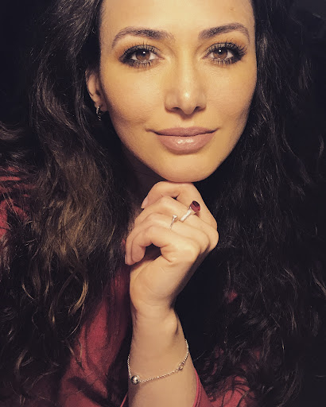

# PRE-FAZA-3 — audit de pre-migrare

Audit read-only executat pe **2026-09-08**, înainte de reconstrucția
prototipului static în WordPress + Elementor (Faza 3).

Domeniu auditat live: `ioana-balan.ro` — doar cereri `GET`/`HEAD`.
Repo auditat: `/workspaces/ioana-balan`, fără modificări de fișiere existente.

---

## STARE GIT

| | |
|---|---|
| Branch activ | `main` |
| Remote | `origin` → `https://github.com/laur2198/ioana-balan` |
| Working tree la start | curat (`nothing to commit, working tree clean`) |
| Commit-uri nepushate la start | **niciunul** — `git rev-list --left-right --count origin/main...HEAD` = `0 0` |
| HEAD la start | `f899aeb merge: oferte/servicii, hero index, galerie, WhatsApp CTA` |

Singurul fișier creat de acest audit este `PRE-FAZA-3.md`.

---

## SUMAR EXECUTIV

| # | Sev. | Constatare |
|---|---|---|
| 1 | **CRITIC** | **E-mailul rulează pe aceeași mașină cu site-ul web.** `MX ioana-balan.ro → _dc-mx.582951e3e6b0.ioana-balan.ro → 89.38.233.57`, exact IP-ul care servește HTTP. `mail.ioana-balan.ro` e CNAME către același A. Orice mutare de hosting, schimbare de IP sau reinstalare cPanel rupe simultan site-ul **și** căsuța poștală a clientei. Nu există MX secundar. |
| 2 | **CRITIC** | **Domeniul rulează deja WordPress 6.9.7 + Elementor 3.34.2 + Elementor Pro 3.28.2 (temă Twenty Seventeen), cu 5 pagini publicate și 27 de pagini de atașament indexabile.** „Migrarea în WordPress" nu e o instalare nouă pe teren gol, ci o suprascriere a unui site viu. Nu există dovadă de backup sau de mediu de staging accesibil din exterior. |
| 3 | **CRITIC** | **Două sitemap-uri concurente.** `robots.txt` (bloc Yoast) declară `sitemap_index.xml`; separat, `/sitemap.xml` există și e un fișier static generat cu **Screaming Frog SEO Spider 12.6**, cu `lastmod` din **2020**. Google poate consuma ambele. La migrare, cel static rămâne pe disc și continuă să anunțe URL-uri vechi dacă nu e șters manual. |
| 4 | **MAJOR** | **Canonicalizarea live e pe `www`, canonicalele din prototip sunt pe non-`www`.** Live: toate cele 4 variante converg în `https://www.ioana-balan.ro/` (301, un singur hop). Prototip: toate cele 11 pagini declară `<link rel="canonical" href="https://ioana-balan.ro/...">` și `og:url` la fel. CLAUDE.md §1 declară canonic `ioana-balan.ro`. Trei surse, două valori. |
| 5 | **MAJOR** | **27 de pagini de atașament + 2 arhive de categorie, toate 200 și toate în sitemap, fără echivalent în prototip.** Sunt pagini WordPress autogenerate în jurul unei imagini. Una dintre ele (`/formatie-nunta/ioana-balan-3/`) are titlu SEO propriu, „Formatie nunta Bucuresti-Ilfov \| Oferta preturi sezonul 2021" — deci a fost optimizată intenționat. Vezi tabelul din Blocul B. |
| 6 | **MAJOR** | **Conflict de `@id` în JSON-LD.** `https://ioana-balan.ro/#artist` e declarat `MusicGroup` în `index.html:35` și `EntertainmentBusiness` în `contact.html`. Același nod, două tipuri — entitate contradictorie pentru Google. |
| 7 | **MAJOR** | **Sistemul de accent din cod nu mai e cel din CLAUDE.md §5.** Codul folosește o familie de patru valori (`accent #A01028`, `accent-hover #800020`, `accent-deep #800020`, `accent-edge #C41236`); CLAUDE.md descrie un accent unic `#800020` cu hover `#600018`. `#600018` **nu apare nicăieri** în repo. Global Kit-ul Elementor construit din CLAUDE.md ar reproduce alt sistem decât cel implementat. |
| 8 | **MAJOR** | **`discografie.html:118` folosește un portret ca și copertă de album** (vezi C1), iar același fișier e `image` în schema `EntertainmentBusiness` din `contact.html`. Fișierul (410×512 px) nu figurează în fototeca documentată în CLAUDE.md §10 și nu are identitatea confirmată. |
| 9 | **MAJOR** | **Conținut editorial vechi fără destinație în prototip.** `/video-clipuri/` conține un articol de ~11 sfaturi („Sfaturi pentru o nuntă fără bătăi de cap", ~754 cuvinte). Prototipul are `blog.html` cu 4 carduri și un singur `articol.html`, niciunul pe acest subiect. Un 301 către `galerie.html` mută URL-ul, nu conținutul. |
| 10 | **MINOR** | **Dovada socială „5,0★ / 61 recenzii" nu există nicăieri în prototip.** Badge-ul Google a fost scos în `2a7a145`, iar rândul „zona deservită" în `6954e00` — ambele **înainte** de `aedc92e`. Nu există `aggregateRating` în niciun bloc JSON-LD. CLAUDE.md §4 și §9 tratează cifra ca diferențiator decis. |

---

## BLOC A — SITE-UL LIVE (infrastructură)

### A1. Headere HTTP

`curl -sI https://ioana-balan.ro` → **301** către `https://www.ioana-balan.ro/`.

| Header | Valoare | Ce indică |
|---|---|---|
| `server` | `LiteSpeed` | server web LiteSpeed (nu Apache/nginx) |
| `x-powered-by` | `PHP/8.4.24` | versiunea PHP expusă public |
| `x-redirect-by` | `WordPress` | redirectul e făcut de PHP/WordPress, nu de server |
| `x-litespeed-cache-control` | `public,max-age=604800` | LiteSpeed Cache activ, TTL 7 zile |
| `x-litespeed-tag` | `108_front,108_URL.…,108_F,108_Po.3068,108_PGS,108_` | tag-uri de cache; `108` = ID-ul blogului/instalării, `Po.3068` = post ID 3068 (homepage) |
| `strict-transport-security` | `max-age=31536000; includeSubDomains` | HSTS activ |
| `x-frame-options` | `SAMEORIGIN` | |
| `x-content-type-options` | `nosniff` | |
| `referrer-policy` | `strict-origin-when-cross-origin` | |
| `x-xss-protection` | `1; mode=block` | header depreciat, dar prezent |
| `x-permitted-cross-domain-policies` | `none` | |
| `alt-svc` | `h3=":443"; ma=2592000, h3-29=…` | HTTP/3 disponibil |
| `vary` | `User-Agent` | |
| `edit` | `Set-Cookie "(.*)" "$1; HttpOnly; Secure"` | header nestandard, aproape sigur o directivă de rescriere scursă în răspuns |

**Fără CDN/proxy.** Niciun `cf-ray`, `cf-cache-status`, `x-cache`, `via`. Cloudflare
e folosit **doar ca DNS autoritativ** (vezi A4), cu proxy dezactivat.

Observație: `x-powered-by: PHP/8.4.24` expune versiunea exactă de PHP.

### A2. Canonicalizare — cele 4 variante

| Pornire | Lanț | Cod final | Hop-uri |
|---|---|---|---|
| `http://ioana-balan.ro` | → `https://www.ioana-balan.ro/` | 200 | 1 |
| `https://ioana-balan.ro` | → `https://www.ioana-balan.ro/` | 200 | 1 |
| `http://www.ioana-balan.ro` | → `https://www.ioana-balan.ro/` | 200 | 1 |
| `https://www.ioana-balan.ro` | (direct) | 200 | 0 |

**Canonicalizarea NU lipsește** — e completă, corectă și fără lanțuri multiple:
un singur 301 din orice variantă. Ținta este **`www`**.

Conflictul (punctul 4 din sumar) e între această realitate și prototip, unde
toate canonicalele și `og:url` sunt scrise pe **non-`www`**:

```
index.html:7                 https://ioana-balan.ro/
galerie.html:7               https://ioana-balan.ro/galerie.html
despre.html:6                https://ioana-balan.ro/despre.html
discografie.html:6           https://ioana-balan.ro/discografie.html
oferte.html:6                https://ioana-balan.ro/oferte.html
faq.html:6                   https://ioana-balan.ro/faq.html
contact.html:6               https://ioana-balan.ro/contact.html
blog.html:7                  https://ioana-balan.ro/blog.html
articol.html:9               https://ioana-balan.ro/articol.html
politica-cookie.html:9       https://ioana-balan.ro/politica-cookie.html
termeni-si-conditii.html:9   https://ioana-balan.ro/termeni-si-conditii.html
```

Redirectul e emis de **WordPress** (`x-redirect-by: WordPress`), adică din
`siteurl`/`home` din baza de date — nu din `.htaccess`. Dacă instalarea nouă
setează `home` pe non-`www`, sensul redirectului se inversează silențios.

### A3. Certificat SSL

```
issuer  = C=US, O=Let's Encrypt, CN=YR2
subject = CN=www.ioana-balan.ro
notBefore = Aug 26 13:25:35 2026 GMT
notAfter  = Nov 24 13:25:34 2026 GMT
```

SAN: `cpcontacts.ioana-balan.ro`, `ioana-balan.ro`, `mail.ioana-balan.ro`,
`webdisk.ioana-balan.ro`, `webmail.ioana-balan.ro`, `www.ioana-balan.ro`.

Emitent Let's Encrypt, valabil **77 de zile de la data auditului** (expiră
2026-11-24). Setul de SAN-uri (`cpcontacts`, `webdisk`, `webmail`) este
semnătura unui certificat **AutoSSL emis de cPanel**, ceea ce confirmă
găzduire de tip cPanel/WHM.

### A4. DNS

`dig` nu este disponibil în acest mediu; interogările s-au făcut prin
`https://dns.google/resolve` (DoH, Google Public DNS).

| Tip | Valoare | TTL |
|---|---|---|
| `A` | `89.38.233.57` | 300 |
| `AAAA` | **niciun record** | — |
| `NS` | `adi.ns.cloudflare.com`, `cash.ns.cloudflare.com` | 21600 |
| `MX` | `0 _dc-mx.582951e3e6b0.ioana-balan.ro.` | 300 |
| `TXT` | `v=spf1 +a +mx +ip4:91.216.156.100 ~all` | 300 |
| `CNAME` (apex) | niciunul | — |
| `www` `A` | CNAME → `ioana-balan.ro` → `89.38.233.57` | 5 |
| `_dmarc` `TXT` | **niciun record** | — |

#### CRITIC — e-mailul și web-ul pe aceeași infrastructură

```
MX ioana-balan.ro  →  _dc-mx.582951e3e6b0.ioana-balan.ro
                   →  A 89.38.233.57
A  ioana-balan.ro  →  89.38.233.57      ← ACELAȘI IP
mail.ioana-balan.ro → CNAME ioana-balan.ro → 89.38.233.57
```

Serverul de mail **este** serverul web. Consecințe măsurabile:

- O migrare care schimbă IP-ul (hosting nou, VPS, plan diferit) mută
  simultan web-ul și MX-ul. Dacă zona DNS e actualizată doar pentru `A`,
  `_dc-mx` urmează automat `A`-ul și mailul aterizează pe serverul nou,
  unde căsuța poate să nu existe încă → **respingere sau pierdere de mesaje**.
- Nu există MX de rezervă (o singură intrare, prioritate 0). Nicio coadă de
  backup în timpul unei ferestre de mutare.
- TTL-ul de 300 s limitează dauna, dar nu o elimină.

Numele `_dc-mx.<hash>.<domeniu>` este forma pe care o generează Cloudflare
la onboarding pentru a păstra fluxul de mail existent. Faptul că se rezolvă
la același A ca site-ul confirmă un cPanel „all-in-one".

#### SPF indică un al doilea furnizor

```
v=spf1 +a +mx +ip4:91.216.156.100 ~all
```

`91.216.156.100` are PTR **`s039.host-age.ro`** — alt furnizor decât cel care
servește `89.38.233.57` (fără PTR). SPF-ul autorizează deci și o infrastructură
care nu mai apare în MX. Nu se poate determina din exterior dacă e o relicvă a
unei găzduiri anterioare sau un relay activ.

`+a` și `+mx` sunt mecanisme permisive (autorizează orice IP din A/MX). Nu
există **DMARC**. Nu s-a putut identifica un selector DKIM (selectorul nu e
ghicibil din exterior).

### A5. Detectare platformă

| Sondă | Cod | Observație |
|---|---|---|
| `/wp-login.php` | **200** | ecran de autentificare public |
| `/wp-json/` | **200** | REST API deschis |
| `/readme.html` | **200** | fișier readme WordPress expus |
| `/license.txt` | **200** | expus |
| `/xmlrpc.php` | **405** | prezent (405 pe GET = răspunde la POST) |
| pagină inexistentă | **404** | 404 corect, fără soft-404 |

**Meta generator:**

```html
<meta name="generator" content="WordPress 6.9.7" />
<meta name="generator" content="Elementor 3.34.2; features: additional_custom_breakpoints;
      settings: css_print_method-internal, google_font-enabled, font_display-auto">
```

**Temă activă:** `twentyseventeen` (7 referințe în sursa homepage-ului).
Versiuni de asset din `?ver=`: `2.1.3`, `20210122`, `20211130`, `20230328`,
`20240729`, `20260819`.

**Pluginuri deduse din `/wp-content/plugins/…` în sursa homepage-ului:**

| Plugin | Referințe | Versiune din `?ver=` | Confirmare suplimentară |
|---|---|---|---|
| `elementor` | 22 | `3.34.2` (+ asset-uri la `4.6.13`, `5.15.3`, `5.46.0`) | meta generator |
| `elementor-pro` | 8 | `3.28.2` (+ `1.2.1`) | — |
| `a3-lazy-load` | 5 | `2.7.6` | `lazy_placeholder.gif` în sitemap |
| `wordpress-seo` (Yoast) | 0 în homepage | nedeterminată | `robots.txt` conține blocul Yoast; `sitemap_index.xml` are stylesheet `wp-content/plugins/wordpress-seo/css/main-sitemap.xsl` |

**Elementor Pro (3.28.2) este în urma Elementor core (3.34.2)** — o
diferență de 6 versiuni minore.

**Alte observații din REST API** (`/wp-json/wp/v2/…`):

- `types`: `post`, `page`, `attachment`, `nav_menu_item`, `wp_block`,
  `wp_template`, `wp_template_part`, `wp_global_styles`, `wp_navigation`,
  `wp_font_family`, `wp_font_face`, `elementor_library`.
  **Niciun custom post type propriu.**
- `posts` publicate: **0**. Categoria `fotografii` raportează `count: 1`, dar
  `/wp-json/wp/v2/posts?categories=8` întoarce `[]` → articolul nu e în
  status `publish`. Arhiva randează „Nu am găsit nimic".
- `users`: un singur utilizator, `id: 1`, slug **`admin`** — enumerabil public
  prin REST.
- Lista de pluginuri de mai sus este dedusă **exclusiv** din HTML-ul
  homepage-ului. Pluginuri fără asset front-end (backup, securitate, SMTP,
  formulare pe alte pagini) nu apar. **NEDETERMINAT** fără acces la wp-admin.

### A6. robots.txt și sitemap-uri

**`/robots.txt`** (HTTP 200), conținut integral:

```
# START YOAST BLOCK
# ---------------------------
User-agent: *
Disallow:

Sitemap: https://www.ioana-balan.ro/sitemap_index.xml
# ---------------------------
# END YOAST BLOCK
```

Fără restricții de crawl. Un singur sitemap declarat.

**`/sitemap_index.xml`** (Yoast, HTTP 200):

| Sitemap | lastmod |
|---|---|
| `/page-sitemap.xml` | 2026-01-23T11:52:04+00:00 |
| `/attachment-sitemap.xml` | 2020-03-07T15:55:31+00:00 |
| `/category-sitemap.xml` | — |

**`/sitemap.xml`** (HTTP 200) — **fișier static concurent**, nedeclarat în
`robots.txt`:

```xml
<?xml version="1.0" encoding="utf-8"?><!--Generated by Screaming Frog SEO Spider 12.6-->
```

Conține 5 URL-uri cu `lastmod` 2020-06-06/07, `changefreq: daily` și
`priority` 0.9–1.0, plus blocuri `<image:image>` care trimit la
`wp-content/plugins/a3-lazy-load/assets/images/lazy_placeholder.gif` — adică
sitemap-ul a fost generat de un crawler care a citit placeholderele de
lazy-load în loc de imaginile reale.

---

## BLOC B — INVENTAR URL-URI VECHI

### B1–B2. Metodă și acoperire

Sursa: `sitemap_index.xml` → `page-sitemap.xml` (5), `attachment-sitemap.xml`
(27), `category-sitemap.xml` (1), plus `/formatie-nunta/` (segment părinte
descoperit din structura URL-urilor de atașament) și
`/category/fara-categorie/` (din REST). Total **35 URL-uri**, sub limita de
100. Fiecare a primit un `GET`, cu pauză de 1 s. Nu s-au cerut resurse
(imagini, CSS, JS).

**Toate cele 35 răspund 200.** Niciun 404, niciun redirect intern.

### B3. Harta de redirect

Legendă acțiune: **301** = redirect permanent către echivalent;
**410** = conținut care nu are corespondent și nu se reconstruiește;
**NECLAR** = decizie de conținut, nu tehnică.

| URL vechi | Status | Title | Pagina echivalentă în prototip | Acțiune |
|---|---|---|---|---|
| `/` | 200 | Ioana Bălan Oficial solist muzică populară | `index.html` | 301 |
| `/formatie-nunta/` | 200 | Ioana Bălan Oficial solist muzică populară | `index.html` | 301 |
| `/formatie-nunta-bucuresti/` | 200 | Ioana Balan \| Formatie nunta Bucuresti \| oferta 2026-2027 | `oferte.html` | 301 |
| `/formatie-nunta/despre-mine/` | 200 | despre mine – Ioana Balan Oficial | `despre.html` | 301 |
| `/termeni-si-conditii/` | 200 | termeni si conditii – Ioana Balan Oficial | `termeni-si-conditii.html` | 301 |
| `/video-clipuri/` | 200 | video clipuri – Ioana Balan Oficial | `galerie.html` (parțial) | **NECLAR** |
| `/formatie-nunta/ioana-balan-3/` | 200 | Formatie nunta Bucuresti-Ilfov \| Oferta preturi sezonul 2021 | **niciunul** (pagină de atașament cu titlu SEO propriu) | **NECLAR** |
| `/category/fotografii/` | 200 | fotografii Archives – Ioana Balan Oficial | **niciunul** (arhivă goală, H1 „Nu am găsit nimic") | 410 |
| `/category/fara-categorie/` | 200 | Fara categorie Archives – Ioana Balan Oficial | **niciunul** (arhivă goală) | 410 |
| `/formatie-nunta-bucuresti/formatie-nunta-bucuresti-ioana-balan-solist-muzica-populara-4/` | 200 | Formatie nunta Bucuresti-Ioana Balan-solist muzica populara | **niciunul** | 410 |
| `/formatie-nunta-bucuresti/…-despre-mine/` | 200 | …-solist muzica populara despre mine | **niciunul** | 410 |
| `/formatie-nunta-bucuresti/…-galerie-foto/` | 200 | …-solist muzica populara galerie foto | **niciunul** | 410 |
| `/formatie-nunta-bucuresti/…-modificata/` | 200 | …-solist muzica populara modificata | **niciunul** | 410 |
| `/formatie-nunta-bucuresti/…-si-muzica-de-petrecere/` | 200 | …-solist muzica populara si muzica de petrecere | **niciunul** | 410 |
| `/formatie-nunta-bucuresti/…-video-clip/` | 200 | …-solist muzica populara video clip | **niciunul** | 410 |
| `/formatie-nunta-bucuresti/…-video/` | 200 | …-solist muzica populara video | **niciunul** | 410 |
| `/formatie-nunta/…-si-muzica-de-petrecere-1/` | 200 | …si muzica de petrecere | **niciunul** | 410 |
| `/formatie-nunta/…-si-muzica-de-petrecere-14/` | 200 | …si muzica de petrecere | **niciunul** | 410 |
| `/formatie-nunta/…-si-muzica-de-petrecere-16/` | 200 | …si muzica de petrecere | **niciunul** | 410 |
| `/formatie-nunta/…-si-muzica-de-petrecere-17/` | 200 | …si muzica de petrecere | **niciunul** | 410 |
| `/formatie-nunta/…-si-muzica-de-petrecere-low/` | 200 | …si muzica de petrecere | **niciunul** | 410 |
| `/formatie-nunta/despre-mine/…-si-muzica-de-petrecere-2/` | 200 | …si muzica de petrecere | **niciunul** | 410 |
| `/formatie-nunta/despre-mine/…-si-muzica-de-petrecere-22/` | 200 | …si muzica de petrecere | **niciunul** | 410 |
| `/formatie-nunta/fullcolor_1024x1024_72dpi/` | 200 | FullColor_1024x1024_72dpi | **niciunul** | 410 |
| `/formatie-nunta/fullcolor_1024x1024_72dpi-2/` | 200 | FullColor_1024x1024_72dpi | **niciunul** | 410 |
| `/formatie-nunta/imagine/` | 200 | IMAGINE | **niciunul** | 410 |
| `/formatie-nunta/logo-floraria-iris/` | 200 | Logo Floraria Iris | **niciunul** (logo partener terț) | 410 |
| `/formatie-nunta/nunta_alex_violeta_buzau_fotograf_vlad_pahontu_36-6289/` | 200 | Ioana Balan Nunta Buzau | **niciunul** | 410 |
| `/video-clipuri/_mg_8388/` | 200 | Formatie nunta Bucuresti Ioana Balan Oficial | **niciunul** | 410 |
| `/video-clipuri/fullsizeoutput_429/` | 200 | fullsizeoutput_429 | **niciunul** | 410 |
| `/video-clipuri/nunta_alex_violeta_buzau_fotograf_vlad_pahontu_37-3726/` | 200 | Nunta_Alex_Violeta_Buzau_… | **niciunul** | 410 |
| `/video-clipuri/nunta_alex_violeta_buzau_fotograf_vlad_pahontu_38-06308/` | 200 | Ioana Balan Oficial | **niciunul** | 410 |
| `/video-clipuri/nunta_alex_violeta_buzau_fotograf_vlad_pahontu_41-3847/` | 200 | Nunta_Alex_Violeta_Buzau_… | **niciunul** | 410 |
| `/video-clipuri/nunta_alex_violeta_buzau_fotograf_vlad_pahontu_42-06405/` | 200 | Nunta_Alex_Violeta_Buzau_… | **niciunul** | 410 |
| `/video-clipuri/oferta-nunta-ro-logo/` | 200 | oferta-nunta.ro logo | **niciunul** (logo director terț) | 410 |

**H1-uri (primul din pagină), pentru cele 5 pagini reale:**

| URL | H1 |
|---|---|
| `/` | Formatie nunta Bucuresti Ioana Balan Oficial, form… |
| `/formatie-nunta/` | (identic cu `/`) |
| `/formatie-nunta-bucuresti/` | Formatie pentru nunta si pentru botez din Bucuresti… |
| `/formatie-nunta/despre-mine/` | pret formatie nunta Bucuresti 2021, Formatii nunta… |
| `/video-clipuri/` | pret formatie nunta Bucuresti 2021, Formatii nunta… |
| `/termeni-si-conditii/` | **(niciun `<h1>`)** |

`/formatie-nunta/despre-mine/` și `/video-clipuri/` au **același H1**, care
este de fapt un șir de cuvinte-cheie, nu un titlu.

### URL-uri unde se pierde SEO — explicit

- **29 din 35** de URL-uri (27 atașamente + 2 arhive de categorie) **nu au
  echivalent** în prototip. Toate răspund 200 azi și toate sunt în sitemap.
- Dintre ele, **`/formatie-nunta/ioana-balan-3/`** este singura cu semnal SEO
  propriu vizibil: titlu „Formatie nunta Bucuresti-Ilfov | Oferta preturi
  sezonul 2021", H1 „formatie nunta bucuresti ioana balan", ~156 cuvinte,
  canonical auto-referențial. A fost optimizată manual. **NEDETERMINAT** dacă
  primește trafic — necesită Search Console.
- **`/video-clipuri/`** (~754 cuvinte, cel mai lung conținut editorial de pe
  site după T&C) nu are destinație. Un 301 către `galerie.html` păstrează
  URL-ul, dar cele 11 sfaturi despre organizarea nunții dispar.
- `/formatie-nunta/` are deja `<link rel="canonical" href="https://www.ioana-balan.ro/">`
  — duplicatul e rezolvat pe partea de indexare, dar URL-ul rămâne accesibil.

### Sens invers: pagini noi fără antecedent

`galerie.html`, `discografie.html`, `blog.html`, `articol.html`, `faq.html`,
`contact.html`, `politica-cookie.html` nu au URL vechi corespondent — deci
nici redirect de primit, nici autoritate de moștenit.

**Atenție la `termeni-si-conditii`:** URL-ul vechi este indexabil și în
sitemap; pagina din prototip poartă `<meta name="robots" content="noindex, follow">`
(`termeni-si-conditii.html:8`, la fel `politica-cookie.html:8`). Un 301 către
o pagină `noindex` scoate URL-ul din index.

---

## BLOC C — STAREA PROTOTIPULUI

### C1. `discografie.html` — coperta de album este un portret. **CONFIRMAT.**

Linia **118**, citată integral:

```html

```

Fișier: **`assets/img/ioana-balan-portrait-artist-muzica-populara-s.jpg`**,
**410 × 512 px**, 55 349 octeți.

Inspectat vizual: **prim-plan de portret** (cap și umeri, mână sub bărbie,
fundal întunecat) — nu grafică de copertă. Este așezat într-un container
`aspect-square` cu `object-cover`, deci imaginea 4:5 e tăiată suplimentar pe
verticală.

Trei circumstanțe agravante:

1. **Nu figurează în fototeca documentată** (CLAUDE.md §10 listează 14
   fotografii, niciuna cu acest nume). Nu are deci nici verificarea de
   identitate din §10.
2. **Este singura imagine `` de conținut din pagină.** Celelalte trei
   `` sunt logo-ul. Cele două coperte reale de arhivă existente în repo —
   `discografie-album-glasul-inimii.jpg` (512×384) și
   `discografie-album-radacini.png` (512×512) — sunt folosite doar ca
   `background-image` la `opacity-30` / `opacity-40`, pe liniile 229 și 244.
3. **Același fișier e `image` în schema `EntertainmentBusiness`** din
   `contact.html` — deci portretul ajunge și în datele structurate ca imagine
   reprezentativă a afacerii.

### C2. Footer — comparație cu starea dinainte de `aedc92e`

`aedc92e` = „Compact the footer and drop its navigation" (2026-09-02), strămoș
al `HEAD`.

**Premisele întrebării, verificate:**

| Element | În `aedc92e^` (înainte) | Azi | Când a dispărut |
|---|---|---|---|
| Navigație în footer | **6 linkuri**, nu 7: Acasă, Galerie, Discografie, Oferte, Blog, Contact (lipseau Despre și FAQ) | absentă | **`aedc92e`** |
| Badge Google | **absent deja** | absent | `2a7a145` „Remove the Google review badge from every page" — **anterior** lui `aedc92e` |
| Zona deservită | **absentă deja** (rămăsese doar comentariul `<!-- Brand + dovadă socială + zona deservită -->`) | absentă | `6954e00` „footer: scoate rândul cu zona deservită" — **anterior** lui `aedc92e` |
| ANPC | prezent | **prezent** | — |
| SAL (`anpc.ro/ce-este-sal/`) | prezent | **prezent** | — |

`aedc92e` a scos, în plus față de navigație: titlurile de coloană
„Navigare" / „Social" / „Informații" / „Contact", și a convertit cele 4
linkuri sociale text în iconuri SVG.

**Ce a câștigat footerul după `aedc92e`:**

- linkuri reale către `termeni-si-conditii.html` și `politica-cookie.html`
  (înainte erau `<span>`-uri gri, comentate ca „pagini inexistente") —
  commit `9e2c0f5`
- rândul de credite „Proiect dezvoltat de Grand Music Events · Site realizat
  de Green Pheonix Concept" — commit `101e1ae`
- logo `assets/logo-alb-400w.png` cu `srcset` 1x/2x, în loc de
  `logo-ioana-balan-crop.jpg` — commit `088914b`
- adresa corectă `ioanabalanoficial@gmail.com` în locul lui
  `contact@ioanabalan.ro`

**Raport per pagină:** footerul este **byte-identic pe toate cele 11 pagini**
(`md5` al blocului `<footer>…</footer>` = `52dcedc9f5…`, 84 de linii, pe
fiecare fișier). Nu există nicio divergență de raportat per pagină.

| | articol | blog | contact | despre | discografie | faq | galerie | index | oferte | politica-cookie | termeni |
|---|---|---|---|---|---|---|---|---|---|---|---|
| nav | – | – | – | – | – | – | – | – | – | – | – |
| badge Google | – | – | – | – | – | – | – | – | – | – | – |
| zona deservită | – | – | – | – | – | – | – | – | – | – | – |
| ANPC | ✓ | ✓ | ✓ | ✓ | ✓ | ✓ | ✓ | ✓ | ✓ | ✓ | ✓ |
| SAL | ✓ | ✓ | ✓ | ✓ | ✓ | ✓ | ✓ | ✓ | ✓ | ✓ | ✓ |
| T&C + cookie | ✓ | ✓ | ✓ | ✓ | ✓ | ✓ | ✓ | ✓ | ✓ | ✓ | ✓ |
| social (4 iconuri) | ✓ | ✓ | ✓ | ✓ | ✓ | ✓ | ✓ | ✓ | ✓ | ✓ | ✓ |

Rândul de date de firmă (CUI / Reg. Com. Grand Music Events) există în toate
cele 11 fișiere, dar **comentat în HTML** — nu se randează.

### C3. Consistență header/footer între toate cele 11 fișiere

**Footer:** identic la nivel de octet pe toate cele 11 (vezi C2).

**Header:** hash-urile diferă între pagini, dar `diff` arată că singurele
diferențe sunt:

1. **Starea activă a linkului curent** — pagina activă folosește
   `text-primary border-b border-primary pb-1`, celelalte
   `text-on-surface-variant hover:text-primary`. Comportament corect.
2. **Un al doilea element `<header>` în conținutul principal** pe
   `articol.html` (antetul articolului), `faq.html`, `politica-cookie.html`,
   `termeni-si-conditii.html` (antetele de pagină). Acestea nu fac parte din
   header-ul de site; sunt cauza diferenței de număr de linii (40/33/32 vs 27).

**Navigația este identică pe toate cele 11 pagini** — aceleași 8 linkuri, în
aceeași ordine:

```
index.html  despre.html  galerie.html  discografie.html
oferte.html  faq.html  blog.html  contact.html
```

Alte verificări de consistență:

| Verificare | Rezultat |
|---|---|
| CTA din header | „Rezervă pe WhatsApp" — identic pe toate 11 |
| `id="mobile-menu"` | prezent pe toate 11 |
| Skip-link `href="#continut"` + `id="continut"` | prezente pe toate 11 |
| `<html lang="ro">` | pe toate 11 |
| `<meta name="viewport">` | pe toate 11 |
| `og:title`, `og:url`, `og:description`, `og:image` (+`:width`/`:height`/`:alt`) | pe toate 11 |
| `twitter:*` | 5 tag-uri pe 9 pagini, **3 pe `politica-cookie.html` și `termeni-si-conditii.html`** |
| `<meta name="robots">` | doar pe cele 2 pagini legale (`noindex, follow`) |
| `prefers-reduced-motion` | 3 blocuri în `assets/styles.css` |

**Divergență reală găsită — preîncărcarea fonturilor:**

| Pagină | `-latin` | `-latin-ext` |
|---|---|---|
| `despre.html` | ✓ (500) | **lipsă** |
| `galerie.html` | ✓ (500) | **lipsă** |
| `politica-cookie.html` | ✓ (500) | **lipsă** |
| restul de 8 | ✓ | ✓ |

Subsetul `latin-ext` conține `ă`, `ș`, `ț` (`U+0102/0103`, `U+0218–021B`).
Cele trei pagini preîncarcă doar subsetul care **nu** conține diacriticele
românești din titluri.

`blog.html` și `index.html` preîncarcă greutatea **400**; celelalte 9
preîncarcă **500**.

### C4. Dependențe externe rămase

**Rezultatul căutării de CDN-uri expirabile: `googleusercontent.com` nu mai
apare nicăieri** (`.html`, `.css`, `.js`). Nici `fonts.googleapis.com`, nici
`fonts.gstatic.com`. Placeholderele Stitch au fost eliminate.

**Singura dependență externă de runtime — Tailwind Play CDN, pe toate cele 11 pagini:**

| Fișier | Linie |
|---|---|
| `index.html` | 51 |
| `despre.html` | 27 |
| `galerie.html` | 37 |
| `discografie.html` | 54 |
| `oferte.html` | 28 |
| `faq.html` | 28 |
| `contact.html` | 28 |
| `blog.html` | 50 |
| `articol.html` | 44 |
| `politica-cookie.html` | 28 |
| `termeni-si-conditii.html` | 29 |

```html
<script src="https://cdn.tailwindcss.com?plugins=forms,container-queries"></script>
```

Urmat imediat, pe fiecare pagină, de `<script src="assets/tailwind.config.js"></script>`.

**Comentariu mort:** `discografie.html:23` conține `<!-- Google Fonts: EB Garamond -->`
imediat înainte de blocul „Fonturi locale…". Linkul pe care îl descria nu mai
există. Singura pagină cu această relicvă.

**Toate gazdele externe referite (număr de apariții în `.html`/`.css`/`.js`):**

| Gazdă | N | Rol |
|---|---|---|
| `ioana-balan.ro` | 65 | canonical, og:url, `@id` schema |
| `wa.me` | 50 | CTA WhatsApp |
| `anpc.ro` | 26 | footer legal |
| `www.youtube.com` | 23 | canal + embed-uri |
| `schema.org` | 13 | `@context` |
| `www.w3.org` | 12 | `xmlns` SVG |
| `www.tiktok.com` / `www.instagram.com` / `www.facebook.com` | 12 fiecare | footer social |
| `grand-music.ro` | 11 | credit footer |
| **`cdn.tailwindcss.com`** | **11** | **runtime CSS** |
| `www.dataprotection.ro` | 4 | ANSPDCP, T&C |
| `www.youtube-nocookie.com` | 2 | domeniul embed-ului lazy |
| `support.google.com`, `support.mozilla.org`, `support.microsoft.com`, `support.apple.com`, `help.opera.com`, `policies.google.com` | 2 fiecare | politica de cookie |
| `youtu.be` | 1 | |
| `ro.pinterest.com` | 1 | `sameAs`, `index.html:47` |

Verificare de disponibilitate (`GET`, urmărind redirecturi):

| URL | Cod |
|---|---|
| `https://www.facebook.com/ioanabalanoficial` | 200 |
| `https://www.instagram.com/ioanabalanoficial/` | 200 |
| `https://www.youtube.com/channel/UCNTWODu5imMryMhkbbw6vEQ` | 200 |
| `https://www.tiktok.com/@ioanabalanmusic` | 200 |
| `https://ro.pinterest.com/ioanabalanoficial/` | 200 |
| `https://grand-music.ro` | 200 |
| `https://anpc.ro` și `https://anpc.ro/ce-este-sal/` | **timeout la 60 s (cod 000)** |

`anpc.ro` — **NEDETERMINAT**: nu se poate distinge din acest mediu între site
indisponibil și filtrare de rețea către `anpc.ro` din infrastructura
Codespaces. De reverificat dintr-o rețea românească.

---

## BLOC D — DESIGN TOKENS

### D1. Culori — toate valorile, cu număr de apariții

Surse scanate: cele 11 `.html`, `assets/styles.css`, `assets/tailwind.config.js`,
`assets/motifs.svg`.

| Valoare | N | Primele locuri |
|---|---|---|
| `#e5e2e1` | 15 | `styles.css:163,282,292` |
| `#800020` | 9 | `styles.css:6,249,473`; `tailwind.config.js:16,17` |
| `#c41236` | 8 | `styles.css:146,461,531`; `tailwind.config.js:18` |
| `#131313` | 8 | `styles.css:162,304,306` |
| `#a01028` | 6 | `styles.css:6,328,613`; `tailwind.config.js:15` |
| `#c8c6c5` | 5 | `styles.css:342`; `tailwind.config.js:21,23` |
| `#fff` | 4 | `styles.css:329,384,691` |
| `rgba(0,0,0,0.3)` | 4 | `styles.css:386,402,403` |
| `#1c1b1b` | 4 | `styles.css:474,510`; `tailwind.config.js:28` |
| `#c6c6c6` | 4 | `motifs.svg:5,6`; `tailwind.config.js:19` |
| `rgba(200,198,197,0.4)` | 3 | `styles.css:191`; `blog.html:342`; `index.html:518` |
| `rgba(142,145,146,0.15)` | 3 | `styles.css:187,196`; `index.html:523` |
| `rgba(196,18,54,0.18)` | 3 | `styles.css:280,551,578` |
| `#c4c7c7` | 3 | `styles.css:428,511`; `tailwind.config.js:41` |
| `#20201f` | 3 | `styles.css:466,502`; `tailwind.config.js:50` |
| `rgba(28,27,27,0.6)` | 2 | `articol.html:294,297` |
| `rgba(227,226,222,0.15)` | 2 | `styles.css:202`; `blog.html:345` |
| `rgba(19,19,19,0)` | 2 | `styles.css:306,310` |
| `rgba(37,211,102,0)` | 2 | `styles.css:403,404` |
| `#ffb3b1` | 2 | `tailwind.config.js:24,27` |
| `#313030` | 2 | `tailwind.config.js:37,61` |
| `#353535` | 2 | `tailwind.config.js:39,52` |

**Valori cu o singură apariție — 44 în total** (candidate la eliminare):

*În `assets/tailwind.config.js` — 25 de tokeni Material Design 3 nefolosiți
nicăieri altundeva:*

`#e3e2e2` (20) · `#484949` (22) · `#121212` (26) · `#93000a` (29) ·
`#8e9192` (30) · `#0e0e0e` (32) · `#7e7d7d` (33) · `#ffb4ab` (34) ·
`#464747` (36) · `#474646` (38) · `#2f0004` (40) · `#630d16` (42) ·
`#2f3131` (43) · `#393939` (45) · `#82252a` (46) · `#5f5e5e` (47) ·
`#444748` (48) · `#ffdad6` (54) · `#ffdad8` (55) · `#b8b8b8` (56) ·
`#1a1c1c` (59) · `#2a2a2a` (60)

*În `assets/styles.css` — 22:*

`rgb(28,27,27)` (186) · `rgb(34,33,33)` (192) · `rgba(28,27,27,0.85)` (195) ·
`rgba(198,198,198,0.2)` (199) · `rgba(142,145,146,0.3)` (208) ·
`rgba(142,145,146,0.2)` (213) · `rgba(198,198,198,0.28)` (233) ·
`#25d366` (383, verde WhatsApp) · `rgba(37,211,102,0.45)` (402) ·
`rgba(196,18,54,0.75)` (454) · `#ffffff` (460) · `rgba(198,198,198,0.18)` (498) ·
`#161615` (514) · `rgba(196,18,54,0.14)` (563) · `#0d0d0d` (624) ·
`rgba(68,71,72,0.2)` (625) · `rgba(0,0,0,0.78)` (660) · `rgba(0,0,0,0.28)` (661) ·
`rgba(0,0,0,0.10)` (662) · `rgba(255,255,255,0.85)` (676) ·
`rgba(19,19,19,0.55)` (678) · `rgba(255,255,255,0.8)` (713)

*În HTML — 1:* `rgba(200,198,197,0.08)` — `articol.html:294`

#### Constatări de sistem

1. **`assets/tailwind.config.js` conține 48 de tokeni de culoare**, dintre care
   **cel puțin 25 nu sunt folosiți nicăieri** — paleta Material Design 3
   generată automat de Stitch (`error`, `error-container`, `tertiary`,
   `inverse-primary`, `on-secondary-fixed-variant` etc.), inclusiv tokenii de
   eroare `#93000a` și `#ffb4ab` pe care CLAUDE.md §5 îi declară „eliminate
   complet".
2. **Accentul real e o familie de patru valori, nu una:**

   | Token | Valoare | Rol declarat în `tailwind.config.js:6-8` |
   |---|---|---|
   | `accent` | `#A01028` | interactiv |
   | `accent-hover` | `#800020` | interactiv (hover) |
   | `accent-deep` | `#800020` | decorativ |
   | `accent-edge` | `#C41236` | bordura CTA-urilor |

   `#600018`, hover-ul din CLAUDE.md §5, **nu apare în repo**. `#A01028` și
   `#C41236` **nu apar în CLAUDE.md**. Antetul lui `tailwind.config.js`
   documentează raportul de contrast (2,30:1 formă pe `#131313` pentru
   `#A01028` față de 1,72:1 pentru `#800020`), deci schimbarea a fost
   deliberată; documentul de referință nu a fost actualizat.
3. **Un al treilea „primary" concurent:** tokenul Tailwind `primary` este
   `#c8c6c5` (argintiu), nu bordo. Clasa `text-primary` apare masiv în markup
   pentru eyebrow-uri — dar în `assets/styles.css` unele reguli o repictează.
   `#c8c6c5` este exact culoarea pe care CLAUDE.md §5 o declară eliminată „ca
   fond de buton".
4. `#25d366` (verde WhatsApp) apare o singură dată, `styles.css:383` — a doua
   culoare de accent din sistem, în afara familiei bordo.

### D2. Tipografie — perechi efectiv folosite

**Familii declarate** (`assets/tailwind.config.js`, `fontFamily`) — **niciuna
nu are stivă de rezervă**:

```js
"label-md": ["Inter"],  "body-lg": ["Inter"],  "body-md": ["Inter"],
"headline-lg": ["EB Garamond"], "headline-md": ["EB Garamond"],
"headline-lg-mobile": ["EB Garamond"], "display-lg": ["EB Garamond"]
```

**Scala de tokeni** (`fontSize`) și utilizarea reală:

| Token | Familie | px | line-height | weight | letter-spacing | `font-*` | `text-*` | Rol observat |
|---|---|---|---|---|---|---|---|---|
| `display-lg` | EB Garamond | **48** | 56 (1,167) | 500 | −0,02em | 31 | 17 | H1; H2 din benzile de CTA |
| `headline-lg` | EB Garamond | **32** | 40 (1,25) | 500 | — | 48 | 48 | H2 de secțiune |
| `headline-lg-mobile` | EB Garamond | **28** | 36 (1,286) | 500 | — | 0 | 1 | practic nefolosit |
| `headline-md` | EB Garamond | **24** | 32 (1,333) | 500 | — | 152 | 151 | H3; H2 în paginile legale |
| `body-lg` | Inter | **18** | 28 (1,556) | 400 | — | 28 | 28 | intro/lead |
| `body-md` | Inter | **16** | 24 (1,5) | 400 | — | 284 | 120 | corp de text |
| `label-md` | Inter | **14** | 20 (1,429) | **600** | 0,05em | 227 | 197 | eyebrow, nav, butoane |

**Roluri, în valori px reale:**

| Rol | Familie | Mobil → Desktop | Weight | Line-height |
|---|---|---|---|---|
| H1 | EB Garamond | 28–36px → **48px** | 500 | `leading-tight` (1,25) |
| H2 secțiune | EB Garamond | 24–28px → **32px** | 500 | 1,25 |
| H2 CTA final | EB Garamond | 26–28px → **48px** | 500 | 1,25 |
| H3 | EB Garamond | 16–20px → **24px** | 500 | 1,333 |
| Body | Inter | **16px** | 400 | 1,5 |
| Lead / intro | Inter | 16px → **18px** | 400 | 1,556 |
| Small / notă | Inter | **12–13px** | 400 | — |
| Buton | Inter | **14px** | 600 | 1,429, `tracking-[0.2em]` |
| Eyebrow | Inter | **10–14px** | 600 | uppercase, `tracking-widest` |

**Trei scale tipografice paralele coexistă:**

1. Scala de tokeni de mai sus (7 trepte).
2. **Scala Tailwind implicită**, folosită în 46 de locuri, pe toate cele 11
   pagini: `text-3xl` (19×, =30px), `text-4xl` (18×, =36px), `text-2xl` (8×,
   =24px), `text-xl` (9×, =20px), `text-base` (16×, =16px), `text-lg`,
   `text-sm`, `text-5xl` (1× fiecare). Concentrate în `oferte.html` (17
   apariții).
3. **Valori arbitrare `text-[Npx]`, 244 de apariții, 19 valori distincte:**
   12px (91×), 16px (37×), 24px (33×), 20px (13×), 28px (12×), 13px (12×),
   11px (9×), 18px (8×), 36px (5×), 10px (4×), 32px (3×), 30px (3×), 26px (3×),
   15px (3×), 56px (2×), 48px (2×), 14px (2×), 80px (1×), 120px (1×).

Pentru un Global Kit Elementor asta înseamnă **peste 25 de dimensiuni distincte
de text** în loc de 7.

**Sub pragul de 16px declarat în CLAUDE.md §5** — `text-[10px]` și
`text-[11px]`, 13 apariții, toate pe eyebrow-uri/etichete:

```
blog.html:128,144,160,176        text-[10px]  (etichete de categorie)
blog.html:205,206,207,208,209    text-[11px]  (tag-uri SEO)
oferte.html:145,175,215,242      text-[11px]  (etichete de pachet)
```

`leading-*`: `leading-tight` 43×, `leading-snug` 25×, `leading-relaxed` 13×,
`leading-none` 2×, plus 4 valori arbitrare (`[1.05]`, `[1.1]`, `[1.25]`, `[1.3]`).

`font-semibold` apare de 3 ori direct în markup, în afara sistemului de tokeni.

### D3. Inversiuni de ierarhie H2 — fiecare apariție

**Tipar dominant: H2-ul din banda finală de CTA randează la 48px (`display-lg`),
adică egal cu H1-ul paginii și cu 50% mai mare decât H2-urile de conținut de
deasupra lui (32px).**

| Fișier | Linie | H2 | px (mobil → desktop) | H2 de conținut pe aceeași pagină |
|---|---|---|---|---|
| `articol.html` | **153** | „Plănuiți un eveniment?" | **48 → 48** | 32 (liniile 131, 143) |
| `index.html` | **372** | „Rezervă Formație Nuntă" | 28 → **48** | 28 → 32 (liniile 148, 214, 238, 273, 324) |
| `despre.html` | **187** | „Hai să ne cunoaștem" | 28 → **48** | → 32 (liniile 150, 171) |
| `oferte.html` | **359** | „Verificați dacă data este liberă" | 28 → **48** | → 32 (liniile 139, 285), 28→32 (297) |
| `faq.html` | **343** | „Nu ați găsit răspunsul?" | 26 → **48** | 24 → 32 (liniile 146, 161, 206, 263, 305) |
| `galerie.html` | **243** | „Esența Tradiției în Imagini." | 30 → **48** | 24 → 32 (linia 109) |

Cazul cel mai net este `articol.html:153`: `class="font-display-lg text-display-lg …"`,
fără variantă responsivă — **48px fix**, identic cu H1-ul de la linia 108, într-o
pagină ale cărei H2-uri de conținut sunt la 32px.

**Inversiune de sens opus — H2 mai mic decât H3-urile de sub el:**

| Fișier | Linie | Element | px | Context |
|---|---|---|---|---|
| `oferte.html` | **124** | `<h2 id="conditii-titlu">Condiții comerciale` | **14** (`text-label-md`, uppercase, `tracking-[0.2em]`) | H3-urile din aceeași pagină (147, 177, 217, 244) randează la 20 → 24px. H2 la 14px, H3 la 24px. |

**Alte anomalii de ierarhie:**

| Fișier | Linie | Observație |
|---|---|---|
| `articol.html` | 122 | `<h3>` (24px, citat de deschidere) apare **înaintea** primului `<h2>` (linia 131) |
| `blog.html` | 193 | `<h3>` „Primește Noutăți" la 24px = **exact** dimensiunea H2-urilor paginii (liniile 132, 148, 164, 180) |
| `blog.html` | 203 | `<h3>` „Tag-uri SEO" la 14px (`text-label-md`) |
| `discografie.html` | 264 | H2 CTA la 26 → 32px (`headline-lg`) — **singura** bandă de CTA din site care **nu** urcă la 48px |

`index.html:176` conține un H2 „Pachete de la 4.800 €" la `text-[32px] md:text-display-lg`,
dar linia este **în interiorul unui comentariu HTML** — nu se randează. Nu e
inversiune activă; e menționată pentru că apare la orice grep pe `<h2`.

### D4. Fonturi self-hosted

`assets/fonts/` — **12 fișiere, 444 KiB pe disc**, toate `woff2`. **Niciun
`.woff`, `.ttf` sau `.otf`.**

| Familie | Weight | Style | Subset | Fișier | Octeți | Folosit |
|---|---|---|---|---|---|---|
| EB Garamond | 400 | normal | latin | `eb-garamond-400-latin.woff2` | 23 820 | ✓ (`@font-face` + preload pe `index`, `blog`) |
| EB Garamond | 400 | normal | latin-ext | `eb-garamond-400-latin-ext.woff2` | 56 964 | ✓ |
| EB Garamond | 500 | normal | latin | `eb-garamond-500-latin.woff2` | 25 264 | ✓ (preload pe 9 pagini) |
| EB Garamond | 500 | normal | latin-ext | `eb-garamond-500-latin-ext.woff2` | 64 076 | ✓ (preload pe 6 pagini) |
| EB Garamond | 500 | italic | latin | `eb-garamond-500-italic-latin.woff2` | 26 952 | ✓ (doar `@font-face`) |
| EB Garamond | 500 | italic | latin-ext | `eb-garamond-500-italic-latin-ext.woff2` | 49 256 | ✓ (doar `@font-face`) |
| Inter | 400 | normal | latin | `inter-400-latin.woff2` | 23 664 | ✓ (doar `@font-face`) |
| Inter | 400 | normal | latin-ext | `inter-400-latin-ext.woff2` | 35 000 | ✓ (doar `@font-face`) |
| Inter | 400 | italic | latin | `inter-400-italic-latin.woff2` | 25 040 | ✓ (doar `@font-face`) |
| Inter | 400 | italic | latin-ext | `inter-400-italic-latin-ext.woff2` | 37 592 | ✓ (doar `@font-face`) |
| Inter | 600 | normal | latin | `inter-600-latin.woff2` | 24 452 | ✓ (doar `@font-face`) |
| Inter | 600 | normal | latin-ext | `inter-600-latin-ext.woff2` | 36 260 | ✓ (doar `@font-face`) |

Toate cele 12 au `@font-face` în `assets/styles.css` (liniile 33–…), toate cu
`font-display: swap` și `unicode-range` identic cu subsetarea Google.
**Niciun fișier orfan.**

Greutăți efective: **Inter 400, 400 italic, 600** · **EB Garamond 400, 500,
500 italic**. Formatul este exclusiv `woff2` — fără fallback `woff`, ceea ce
exclude IE11 și Safari &lt; 12 (decizie deja luată, documentată în antetul
fișierului).

Doar EB Garamond este preîncărcat; Inter nu are `preload` pe nicio pagină.

### D5. Inventar assets

| Director | Fișiere | Dimensiune |
|---|---|---|
| `assets/img/` | **54** | **5,4 MB** |
| `assets/fonts/` | 12 | 444 KB |
| `assets/video-thumbs/` | 7 | 601 KB |
| `assets/` (rădăcină) | 10 | ~342 KB |
| **Total `assets/`** | **83** | **6,8 MB** |

**Imagini din `assets/img/` nereferențiate în niciun `.html` — 6 fișiere, 556 KB:**

| Fișier | Dim. | Motiv documentat |
|---|---|---|
| `formatia-in-alb-costum-popular-1440.jpg` | 164K | grupa C, retrasă din galerie (CLAUDE.md §10) |
| `formatia-in-alb-costum-popular-1440.webp` | 164K | idem |
| `formatia-in-alb-costum-popular-800.jpg` | 112K | idem |
| `formatia-in-alb-costum-popular-800.webp` | 72K | idem |
| `invitati-aplauze-480.jpg` | 24K | grupa C, retrasă din galerie |
| `invitati-aplauze-480.webp` | 20K | idem |

Cele 6 corespund exact celor două fotografii marcate „grupa C — aproape sigur
altă persoană, RETRASE" în CLAUDE.md §10. Nereferențierea e intenționată.

**Assets nereferențiate în afara `assets/img/` — 4 fișiere, 212 KB:**

| Fișier | Dim. |
|---|---|
| `assets/logo-alb-600w.png` | 28K |
| `assets/logo-ioana-balan-alb.png` | 56K |
| `assets/logo-ioana-balan-bordo.png` | 64K |
| `assets/logo-ioana-balan-dark.png` | 64K |

Markup-ul folosește doar `logo-alb-400w.png` (1x) și `logo-alb-800w.png` (2x).
Varianta 600w și cele trei logo-uri vechi sunt orfane.

**Referențiate și folosite:** `assets/og-ioana-balan.png` (1200×630, `og:image`),
`assets/motifs.svg`, `assets/styles.css`, `assets/tailwind.config.js`, toate
cele 7 `video-thumbs/*.jpg`.

---

## BLOC E — INVENTAR DE CONȚINUT

### E1. Paginile

Numărătoarea de cuvinte acoperă doar `<main>`, cu `<script>`, `<style>`, `<svg>`
și comentariile eliminate.

| Fișier | Slug propus WP | Cuvinte | Title (lungime) | Meta description (lungime) |
|---|---|---|---|---|
| `index.html` | `/` (front page) | 527 | Ioana Balan \| Formație Nuntă București Premium & Muzică de Petrecere (68) | Ioana Balan - Formație nuntă București premium. Muzică de petrecere autentică… (171) |
| `despre.html` | `/despre/` | 337 | Despre mine \| Ioana Balan (25) | Ioana Balan povestește de unde vine dragostea ei pentru folclorul românesc… (159) |
| `galerie.html` | `/galerie/` | 124 | Galerie \| Ioana Balan — Formație Nuntă București (48) | Galerie foto și video Ioana Balan: momente live de la nunți și evenimente… (173) |
| `discografie.html` | `/discografie/` | 140 | Discografie \| IOANA BALAN - Muzică Populară și de Petrecere (59) | Explorează discografia completă a artistei Ioana Balan… (156) |
| `oferte.html` | `/oferte/` | 807 | Pachete și Prețuri 2026-2027 \| Ioana Balan (42) | Pachete de muzică pentru nuntă și botez cu solista Ioana Balan… (161) |
| `faq.html` | `/intrebari-frecvente/` | 598 | Întrebări frecvente \| Ioana Balan (33) | Răspunsuri despre rezervare și contract, programul artistic… (177) |
| `contact.html` | `/contact/` | 128 | Contact Ioana Balan \| Rezervări Evenimente și Colaborări Muzicale (65) | Contactați-o pe Ioana Balan pentru rezervări nunți… (174) |
| `blog.html` | `/blog/` (arhivă) | 195 | Blog \| Ioana Balan - Sfaturi și Inspirație pentru Evenimente Memorabile (71) | Blog Ioana Balan: sfaturi pentru nunți și botezuri… (162) |
| `articol.html` | `/blog/importanta-luminilor-de-scena/` (post) | 327 | Importanța luminilor de scenă pentru show-ul formației \| Ioana Balan (68) | Importanța luminilor de scenă pentru show-ul unei formații de nuntă… (159) |
| `politica-cookie.html` | `/politica-cookie/` | 858 | Politica de cookie-uri \| Ioana Balan (36) | Cum folosește site-ul ioana-balan.ro modulele cookie… (181) |
| `termeni-si-conditii.html` | `/termeni-si-conditii/` | 1 581 | Termeni și condiții \| Ioana Balan (33) | Condițiile de utilizare a site-ului ioana-balan.ro… (191) |

**Total: 5 622 de cuvinte pe 11 pagini.** Titlurile și descrierile sunt unice
pe fiecare pagină; toate cele 11 au `og:*` complet.

Trei titluri depășesc pragul practic de afișare în SERP (~60 caractere):
`blog.html` (71), `index.html` (68), `articol.html` (68).

`/termeni-si-conditii/` este singurul slug propus care **coincide** cu un URL
vechi existent — deci singurul unde s-ar putea păstra URL-ul fără redirect.
Atenție însă: pagina din prototip e `noindex`.

`articol.html` este un articol demonstrativ (o singură instanță); `blog.html`
listează 4 carduri. La migrare, structura reală de blog trebuie stabilită cu
clienta.

### E2. Blocuri JSON-LD

| Fișier | Blocuri | `@type` | `@id` |
|---|---|---|---|
| `index.html` | 1 | `MusicGroup` | `https://ioana-balan.ro/#artist` |
| `contact.html` | 1 | `EntertainmentBusiness` | `https://ioana-balan.ro/#artist` |
| `blog.html` | 1 | `Blog` | `https://ioana-balan.ro/blog.html` |
| | | `BreadcrumbList` | *(fără `@id`)* |
| `articol.html` | 1 | `BlogPosting` | *(fără `@id`)* |
| `despre.html` | 1 | `AboutPage` | *(fără `@id`)* |
| `discografie.html` | 1 | `MusicAlbum` ×3 | *(fără `@id`)* |
| `faq.html` | 1 | `FAQPage` | `https://ioana-balan.ro/faq.html#faq` |
| `galerie.html` | 1 | `ImageGallery` | *(fără `@id`)* |
| `oferte.html` | 1 | `Product` | *(fără `@id`)* |
| `politica-cookie.html` | **0** | — | — |
| `termeni-si-conditii.html` | **0** | — | — |

Toate blocurile parsează ca JSON valid.

#### `@id` duplicat cu tipuri în conflict

```
https://ioana-balan.ro/#artist
  ├── index.html    → @type: MusicGroup
  └── contact.html  → @type: EntertainmentBusiness
```

Un `@id` identifică **un singur nod** în graful de date structurate. Aici
același nod e declarat simultan grup muzical și afacere de divertisment.
Nodurile diferă și în conținut: cel din `index.html` are `foundingLocation`,
`areaServed` și 5 profile `sameAs`; cel din `contact.html` are `address`,
`telephone`, `email`, `priceRange: "$$"`, `areaServed` — și **niciun `sameAs`**.

`image` din nodul `contact.html` este
`https://ioana-balan.ro/assets/img/ioana-balan-portrait-artist-muzica-populara-s.jpg`
— același fișier discutat la C1.

**Niciun bloc nu conține `aggregateRating`.** Cifra „5,0★ / 61 de recenzii"
(CLAUDE.md §4, §9) nu apare nici în datele structurate, nici în textul vizibil
al vreunei pagini.

`sameAs` din `index.html:42-48` listează **5** profile (Facebook, Instagram,
TikTok, YouTube, **Pinterest**), în timp ce footerul afișează **4** iconuri —
Pinterest lipsește din footer.

### E3. ID-uri de video YouTube

| ID | Fișier : linie | Mecanism | Thumbnail local |
|---|---|---|---|
| `XFdALRgk7Fg` | `index.html:243` | `data-yt` (lazy) | `assets/video-thumbs/XFdALRgk7Fg.jpg` |
| `hzOdwacBNN0` | `index.html:252` | `data-yt` (lazy) | `assets/video-thumbs/hzOdwacBNN0.jpg` |
| `BcUXKbLqrsU` | `galerie.html:137` | `data-yt` (lazy) | `assets/video-thumbs/BcUXKbLqrsU.jpg` |
| `3uyEZ2vY6eE` | `galerie.html:165` | `data-yt` (lazy) | `assets/video-thumbs/3uyEZ2vY6eE.jpg` |
| `Yqw4PZ0pU5o` | `galerie.html:187` | `data-yt` (lazy) | `assets/video-thumbs/Yqw4PZ0pU5o.jpg` |
| `iIYF1xiX6sM` | `galerie.html:209` | `data-yt` (lazy) | `assets/video-thumbs/iIYF1xiX6sM.jpg` |
| `Fj15ExZHAYs` | `galerie.html:227` | `data-yt` (lazy) | `assets/video-thumbs/Fj15ExZHAYs.jpg` |
| `hPACrfwibFw` | `discografie.html:143` | link `youtube.com/watch?v=` | — |

**8 ID-uri distincte.** Cele 7 lazy au corespondent exact 1:1 în
`assets/video-thumbs/` (numele fișierului = ID-ul), fără thumbnail orfan.
Embed-ul se face la click, prin `youtube-nocookie.com` (2 referințe în CSS/JS).

Canalul canonic, **`UCNTWODu5imMryMhkbbw6vEQ`**, apare de 23 de ori pe toate
cele 11 pagini (o dată cu sufixul `/videos`, `discografie.html:128`).

### E4. Formularul de contact

Un singur `<form>` în repo: `contact.html`, începe la **linia 170**.

```html
<form class="space-y-8 md:space-y-10" id="bookingForm">
```

**Fără `action`, fără `method`** — nu trimite nicăieri (confirmă CLAUDE.md §8).

| # | Linie | Element | `name` | `type` | `id` | Obligatoriu | `autocomplete` | Etichetă vizibilă |
|---|---|---|---|---|---|---|---|---|
| 1 | 174 | `input` | `name` | `text` | `name` | **DA** | — | Nume complet |
| 2 | 178 | `input` | `phone` | `tel` | `phone` | **DA** | `tel` | Telefon |
| 3 | 184 | `input` | `date` | `date` | `date` | **DA** | — | Data evenimentului |
| 4 | 188 | `select` | `type` | — | `type` | nu | — | Tipul evenimentului |
| 5 | 199 | `input` | `email` | `email` | `email` | nu | `email` | Adresă email (opțional) |
| 6 | 203 | `textarea` | `message` | — | `message` | nu | — | Detalii suplimentare (opțional) |
| 7 | 212 | `input` | `consent` | `checkbox` | `consent` | **DA** | — | *(text GDPR, mai jos)* |

**Opțiunile din `select[name=type]`:** Concert / spectacol · Nuntă / botez ·
Gală corporate · Recepție privată · Alt tip de eveniment

**Buton:** `<button type="submit">Trimite Solicitarea</button>`

**Checkbox-ul de consimțământ, linia 212** — verificat față de cele trei reguli
din CLAUDE.md §8:

```html
<input aria-describedby="consent-error" … id="consent" name="consent" required type="checkbox">
<label … for="consent">Sunt de acord ca datele introduse să fie folosite pentru
a mi se răspunde la această solicitare. Detalii în
<a … href="termeni-si-conditii.html#sectiunea-12">Politica de confidențialitate</a>.</label>
```

| Regulă | Stare |
|---|---|
| Nebifat implicit | ✓ — niciun atribut `checked` |
| Nu se grupează cu acceptarea T&C | ✓ — text separat, doar despre prelucrarea datelor |
| Nu reia formularea de pe site-ul vechi | ✓ — vezi mai jos |
| Plasat între ultimul câmp și butonul de trimitere | ✓ — între `textarea` (203) și `<button>` (219–221) |
| Linkul are țintă reală | ✓ — `id="sectiunea-12"` există la `termeni-si-conditii.html:254` |
| Mesaj de eroare accesibil | ✓ — `#consent-error`, legat prin `aria-describedby`, `hidden` implicit |
| Toate cele 7 câmpuri au `<label for>` | ✓ |

**Formularul live confirmă riscul semnalat în CLAUDE.md §8.** Pe
`/formatie-nunta-bucuresti/` și `/video-clipuri/`, textul actual este:

> „Accept trimiterea datelor personale introduse în acest formular și sunt de
> acord cu secțiunea **Temeni** și Condiții."

— grupează două consimțăminte și conține typo-ul. Câmpurile live sunt
`Email`, `Phone`, `Phone`, `Message` (două câmpuri „Phone", fără câmp de nume
și fără dată).

**Corespondența cu tabelul din T&C §12.2**, care declară „nume, telefon,
e-mail, data și tipul evenimentului, mesaj" — se potrivește exact cu cele 6
câmpuri de date de mai sus. Coerent.

### E5. Contacte, telefoane, social

#### E-mail

| Adresă | Apariții | Unde |
|---|---|---|
| **`ioanabalanoficial@gmail.com`** | **25** | footer (×2/pagină pe toate cele 11: `href` + text vizibil) + `contact.html:44` (schema JSON-LD), `:133`, `:139` |
| `anspdcp@dataprotection.ro` | 2 | `termeni-si-conditii.html:341` — ANSPDCP, corect |
| `email@exemplu.ro` | 1 | `contact.html:199` — `placeholder` |

**Nicio inconsecvență.** `contact@ioanabalan.ro`, `contact@ioana-balan.ro` și
`ioanablanoficial@gmail.com` (varianta greșită semnalată în CLAUDE.md §10) **nu
mai apar nicăieri.**

#### Telefon

| Formă | Apariții |
|---|---|
| `href="tel:+40722911485"` | 28 (footer ×1 + widget/CTA-uri) |
| `+40 722 911 485` afișat | 17 |
| `+40722911485` (schema, `telephone`) | 29 |

**Un singur număr propriu în tot repo-ul: +40 722 911 485.** Coincide cu
numărul de pe site-ul live, `(+40)722.911.485` — aceeași cifră, altă formatare.

Al doilea număr găsit, `+40 318 059 211` (`termeni-si-conditii.html:340`), este
**telefonul ANSPDCP**, nu al clientei. Corect.

#### WhatsApp

`https://wa.me/40722911485` — **50 de apariții**, același număr peste tot, cu
mesaje pre-completate diferite în funcție de CTA. Consecvent.

#### Social media

| Profil | Apariții | Footer | `sameAs` (`index.html`) | HTTP |
|---|---|---|---|---|
| `https://www.facebook.com/ioanabalanoficial` | 12 | ✓ | ✓ | 200 |
| `https://www.instagram.com/ioanabalanoficial/` | 12 | ✓ | ✓ | 200 |
| `https://www.tiktok.com/@ioanabalanmusic` | 12 | ✓ | ✓ | 200 |
| `https://www.youtube.com/channel/UCNTWODu5imMryMhkbbw6vEQ` | 22 (+1 `/videos`) | ✓ | ✓ | 200 |
| `https://ro.pinterest.com/ioanabalanoficial/` | **1** (`index.html:47`) | **✗** | ✓ | 200 |

**Inconsecvențe:**

1. **Pinterest apare doar în `sameAs`**, niciodată în footer. Fie profilul e
   secundar și nu ar trebui în `sameAs`, fie e activ și lipsește din footer.
2. **`contact.html` nu are `sameAs` deloc**, deși nodul său poartă același
   `@id` ca cel din `index.html` care are 5. Două definiții ale aceleiași
   entități, una fără profile.
3. Handle-ul TikTok (`ioanabalanmusic`) diferă ca tipar de celelalte trei
   (`ioanabalanoficial`). Toate răspund 200, deci nu e o eroare — doar o
   asimetrie de reținut la handoff.

---

## NEDETERMINATE

Formulate ca întrebări. Fiecare necesită acces la hosting/cPanel, la conturi
sau confirmare de la client.

**Infrastructură și e-mail**

1. Câte căsuțe poștale există efectiv pe `ioana-balan.ro` și care sunt
   adresele? Din exterior se vede doar că MX-ul e pe același server cu web-ul;
   conținutul zonei de mail nu e vizibil.
2. Se folosesc căsuțe de tip `@ioana-balan.ro`, sau tot fluxul trece prin
   `ioanabalanoficial@gmail.com` (singura adresă publicată pe site)? Dacă e a
   doua variantă, expunerea la migrare e mult mai mică decât pare.
3. Ce este `91.216.156.100` (`s039.host-age.ro`) din înregistrarea SPF —
   găzduire anterioară rămasă în zonă, sau un relay de mail încă activ?
4. Există DKIM configurat? Selectorul nu poate fi ghicit din exterior. DMARC
   nu există deloc — se dorește adăugat?
5. Cine controlează contul Cloudflare care găzduiește zona DNS
   (`adi.ns` / `cash.ns`) — clienta, un furnizor anterior, sau Green Pheonix?
6. Care este furnizorul de hosting pentru `89.38.233.57`? IP-ul nu are PTR, iar
   certificatul AutoSSL indică doar „cPanel", nu compania.
7. Există backup automat al site-ului și al bazei de date? Cu ce frecvență și
   unde se stochează?
8. Există mediu de staging? Nu se poate detecta din exterior.

**WordPress existent**

9. Lista completă de pluginuri active — cele patru detectate
   (Elementor, Elementor Pro, a3 Lazy Load, Yoast SEO) sunt doar cele cu
   asset-uri pe homepage. Ce altceva rulează (backup, securitate, SMTP,
   formulare, cache)?
10. Licența Elementor Pro este activă și pe cine e înregistrată? Versiunea
    instalată (3.28.2) e în urma core-ului (3.34.2), ceea ce se întâmplă de
    obicei când licența a expirat.
11. Se reface instalarea de la zero sau se lucrează peste cea existentă? De
    răspuns înainte de orice altceva — schimbă complet planul.
12. Există un articol nepublicat în categoria `fotografii` (`count: 1`, dar 0
    postări publice). Ce conține și se recuperează?
13. Utilizatorul `admin` (`id: 1`) e singurul cont. Se păstrează, se
    redenumește, sau se creează unul nou pentru clientă?
14. `/sitemap.xml` static, generat cu Screaming Frog în 2020, se poate șterge
    de pe disc?

**SEO și conținut**

15. Există acces la Google Search Console pentru `ioana-balan.ro`? Fără el nu
    se poate ști care dintre cele 29 de URL-uri fără echivalent primesc
    efectiv trafic — deci nici care merită 301 în loc de 410.
16. `/formatie-nunta/ioana-balan-3/` are titlu SEO optimizat manual („Formatie
    nunta Bucuresti-Ilfov | Oferta preturi sezonul 2021"). A fost o pagină de
    campanie? Se păstrează ca URL?
17. Articolul „Sfaturi pentru o nuntă fără bătăi de cap" de pe `/video-clipuri/`
    (~750 de cuvinte, 11 sfaturi) se migrează ca articol de blog, se rescrie,
    sau se abandonează?
18. Canonicul final: `ioana-balan.ro` (CLAUDE.md §1, canonicalele din prototip)
    sau `www.ioana-balan.ro` (comportamentul live actual)? Alegerea determină
    atât `home`/`siteurl` în WordPress, cât și rescrierea celor 11 canonicale
    din prototip.
19. Există profil Google Business Profile activ pentru care se poate confirma
    „5,0★ / 61 de recenzii"? Cifra nu apare nicăieri în prototip și e declarată
    „decisă" în CLAUDE.md §9.
20. Profilul Pinterest (`ro.pinterest.com/ioanabalanoficial`) este activ și
    administrat? Apare doar în `sameAs`, nu și în footer.

**Conținut vizual — de confirmat cu clienta**

21. Fișierul `ioana-balan-portrait-artist-muzica-populara-s.jpg` (410×512), azi
    copertă de album pe `discografie.html:118` și `image` în schema din
    `contact.html`: este fotografia clientei? Nu figurează în fototeca
    documentată în CLAUDE.md §10 și nu a trecut prin verificarea de identitate
    de acolo.
22. Există grafică reală de copertă pentru albumul „Hai să nu ne mai mințim"
    (2025)?
23. Grupele B și C de fotografii din CLAUDE.md §10 rămân neconfirmate. Cele 6
    fișiere din grupa C sunt deja nereferențiate; grupa B e încă publicată.
24. Există o fotografie peisaj de minimum 1440px pentru banda de hero din
    `despre.html` (marcată provizoriu în markup)?

**Juridic / formular**

25. Ce plugin de formular se folosește în Elementor? Alegerea determină
    conținutul tabelului de destinatari din T&C §12.3, unde
    `[FURNIZOR-HOSTING]` și `[FURNIZOR-EMAIL]` sunt încă placeholdere.
26. Mesajele se stochează în baza de date WordPress? Dacă da, cine configurează
    ștergerea automată la 12 luni, așa cum declară politica?
27. CUI-ul și Nr. Reg. Com. pentru **Grand Music Events** — rândul e prezent,
    dar comentat, în toate cele 11 fișiere.
28. `anpc.ro` și `anpc.ro/ce-este-sal/` nu au răspuns în 60 de secunde din acest
    mediu (cod 000). De reverificat dintr-o rețea din România înainte de a trage
    concluzia că linkurile din footer sunt rupte.
29. Se confirmă că linkul SAL de la ANPC înlocuiește platforma SOL/ODR
    desființată prin Regulamentul (UE) 2024/3228? Întrebarea e deja marcată
    „TODO client/juridic" în footer.
